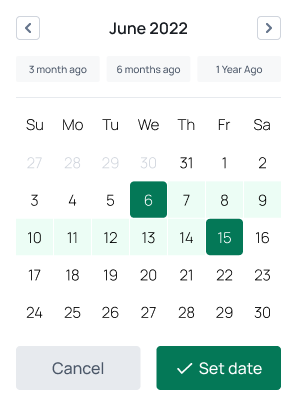

# 📅 Calendar Widget – Figma Dev Mode Demo

Dieses Projekt zeigt, wie man eine UI-Komponente (Calendar Widget) systematisch mit Figma Dev Mode-Struktur aufbaut. Es dient als Beispiel für designtechnisch und technisch saubere Komponenten, die im Developer Mode direkt übergeben werden können.

## 🎯 Ziel
- Aufbau eines interaktiven Kalender-Widgets in Figma
- Strukturierung nach Komponenten-Prinzipien
- Einsatz von Auto Layout, Design Tokens (über Styles), Variants und sauberen Benennungen

## 🧱 Struktur

Die Komponente besteht aus folgenden Elementen:
- **Change Month:** Navigationsbuttons mit Pfeilen (Links/Rechts)
- **Month Heading:** Monat + Jahr (z. B. "June 2022")
- **Quick Select Tabs:** Schnellauswahl für Zeiträume (3 Monate, 6 Monate etc.)
- **Date Grid:** Tagesauswahl mit Zuständen (z. B. selected, in range)
- **Action Buttons:** „Cancel“ und „Set date“ (mit States: primary/secondary)

## 🧪 Genutzte Techniken

| Technik         | Beschreibung                                      |
|----------------|----------------------------------------------------|
| ✅ Auto Layout  | Für Layoutstruktur und responsives Verhalten       |
| ✅ Variants     | Für Buttons, Tabs, Date-Zellen (versch. Zustände)  |
| ✅ Tokens/Styles| Farben, Typografie, Spacing als Styles angelegt    |
| ✅ Dev Mode     | Komponenten sauber benannt und dev-ready strukturiert |

## 📸 Vorschau

## 🧠 Warum das Projekt?
Dieses Mini-Projekt zeigt, wie man Komponenten nicht nur visuell sauber, sondern auch **developer-kompatibel** in Figma erstellt. Es eignet sich als Vorlage für Designsystem
